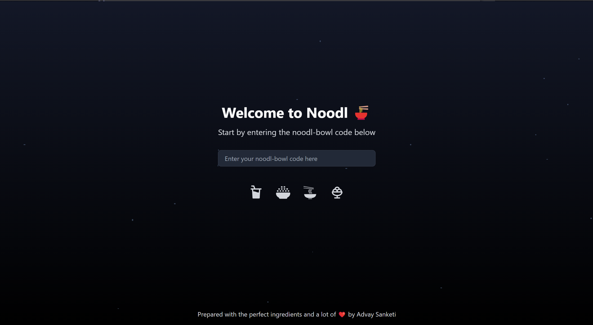
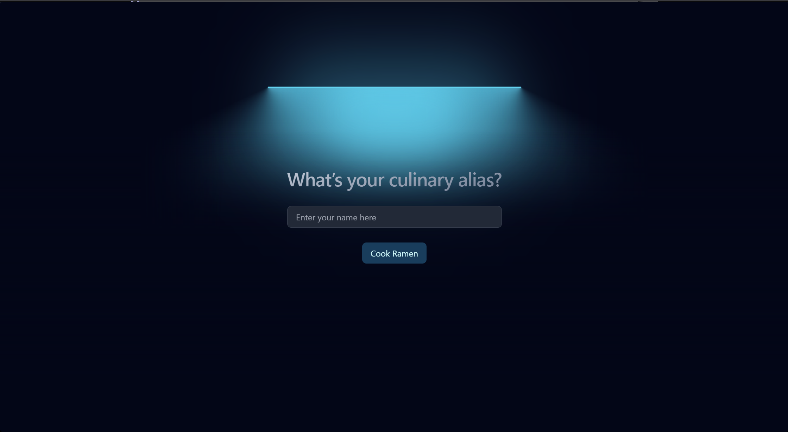
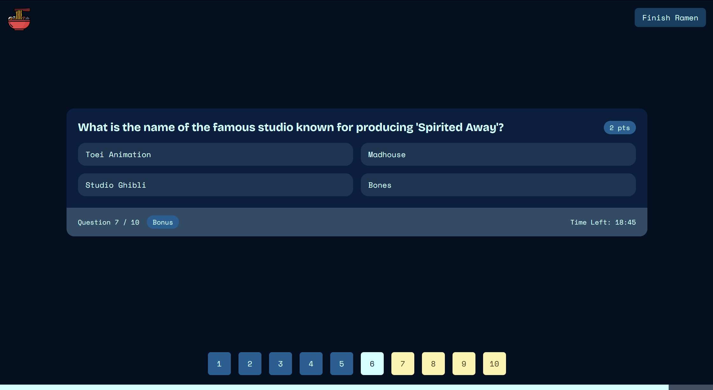
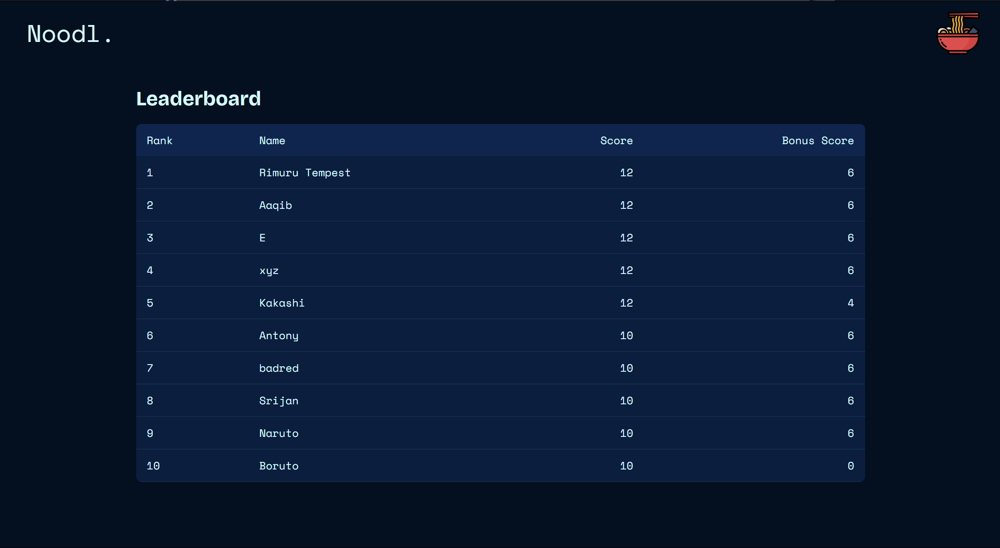
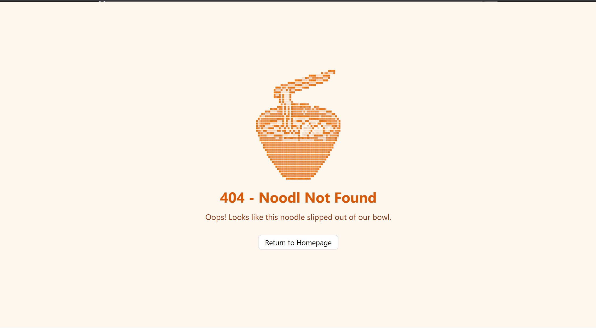

# Noodl 🍜

Noodl is an interactive quiz platform featuring real-time progress tracking, and dynamic leaderboards. It allows users to compete on quizzes, with scores updated live and ranks displayed.

🔗 **Try out Noodl at:** [Noodl](https://noodl-bowl.vercel.app/)

[](https://nextjs.org/)
[](https://tailwindcss.com/)
[](LICENSE)

---

## 📖 Table of Contents

- [Noodl 🍜](#noodl-)
  - [📖 Table of Contents](#-table-of-contents)
  - [✨ Features](#-features)
  - [🚀 Demo](#-demo)
  - [💻 Installation](#-installation)
  - [🔍 Usage](#-usage)
    - [Creating a Quiz Bowl](#creating-a-quiz-bowl)
    - [Taking a Quiz](#taking-a-quiz)
  - [🏗 Architecture](#-architecture)
  - [🤝 Contributing](#-contributing)
  - [📝 License](#-license)
  - [🆘 Support](#-support)

---

## ✨ Features

- 🎯 Interactive quiz platform with unique "noodl-bowl" code system
- 🎨 Beautiful, responsive UI with smooth animations
- 🌙 Dark mode support
- 👤 User authentication and admin panel
- 📊 Real-time leaderboard
- 🎉 Engaging animations and transitions
- 📱 Mobile-friendly design
- 🔒 Secure admin interface
- 📈 Performance analytics

---

## 🚀 Demo

| Page Name          | Screenshot                            |
| ------------------ | ------------------------------------- |
| **Home Page**      |       |
| **Name Selection** |  |
| **Quiz Screen**    |     |
| **Leaderboard**    |     |
| **Admin Panel**    |     |
| **404 Page**       |        |

🔗 **Try out Noodl at:** [Noodl](https://noodl-bowl.vercel.app/)

---

## 💻 Installation

1.  Clone the repository:

    ```bash
    git clone https://github.com/AdvaySanketi/Noodl.git
    cd Noodl
    ```

2.  Install dependencies:

    ```bash
    npm install
    ```

3.  Set up environment variables:

    - Create a `.env.local` file with the following variables:

    ```
    NEXT_PUBLIC_BASEURL=your_base_url
    NEXT_PUBLIC_ADMIN_PASSWORD=your_password
    NEXT_PUBLIC_ADMIN_USERNAME=your_user_name
    MONGO_URI=your_mongo_uri
    ```

4.  Run the development server:
    ```bash
    npm run dev
    ```

---

## 🔍 Usage

### Creating a Quiz Bowl

1. Log in to the admin panel at `/[id]/admin`.
2. Create a new noodl-bowl with your questions.
3. Share the unique bowl code with participants.

### Taking a Quiz

1. Enter the noodl-bowl code on the homepage.
2. Input your culinary alias.
3. Start cooking up answers!

---

## 🏗 Architecture

- **Client**: Next.js frontend
- **API Routes**: Backend APIs
- **Database**: MongoDB
- **Authentication**: Secure user login
- **Quiz Engine**: Dynamic quiz handling
- **Leaderboard**: Real-time score tracking

---

## 🤝 Contributing

Contributions are what make the open-source community such an amazing place to learn, inspire, and create. Any contributions you make are greatly appreciated.

1. Fork the project.
2. Create your feature branch:
   ```bash
   git checkout -b feature/AmazingFeature
   ```
3. Commit your changes:
   ```bash
   git commit -m 'Add some AmazingFeature'
   ```
4. Push to the branch:
   ```bash
   git push origin feature/AmazingFeature
   ```
5. Open a pull request.

---

## 📝 License

Distributed under the MIT License. See [LICENSE](LICENSE) for more information.

---

## 🆘 Support

Having trouble? Want to request a feature? Here's how you can get help:

- Open an issue.
- Contact the maintainer: [Advay Sanketi](https://advay-sanketi-portfolio.vercel.app/)

<p align="center">Prepared with the perfect ingredients and a lot of ❤️ by Advay Sanketi</p>
